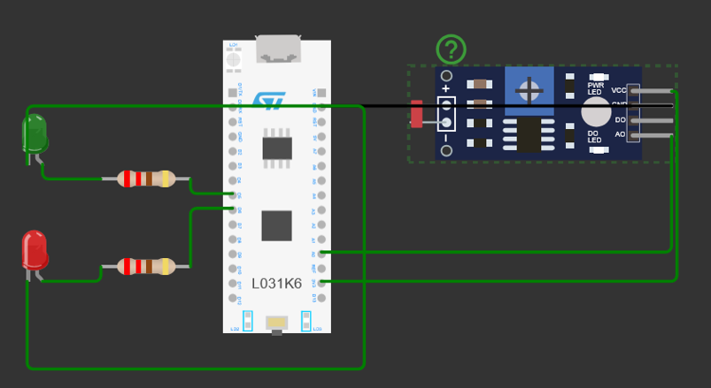
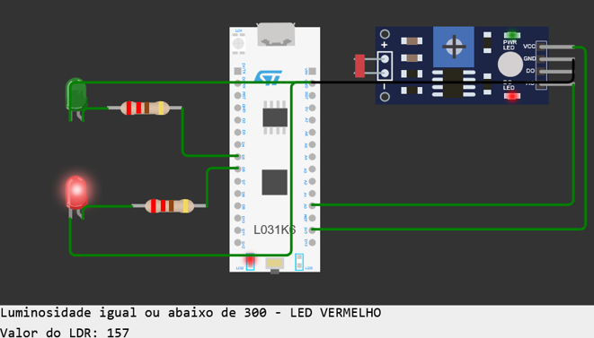
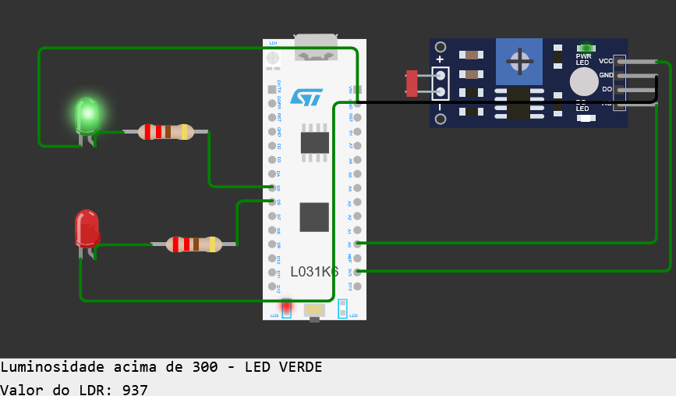

# AVA2 – Sistemas Embarcados
## Controle de Luminosidade com STM32 e LDR

Projeto desenvolvido para a disciplina de Sistemas Embarcados, utilizando o microcontrolador STM32L031K6T6, sensor LDR e ambiente de simulação Wokwi.

## Objetivo

Desenvolver um sistema capaz de realizar a leitura analógica de um sensor LDR, comparar o valor obtido com um limiar definido e controlar dois LEDs de acordo com a leitura realizada.

## Tecnologias e ferramentas

- STM32L031K6T6
- LDR (Photoresistor)
- LED verde
- LED vermelho
- Arduino/C++
- Wokwi

## Funcionamento

O sensor LDR realiza a leitura da luminosidade e envia o valor analógico para a entrada A0 do microcontrolador STM32.

O sistema compara continuamente o valor obtido com o limiar definido em 300:

- **Valor do LDR > 300:** LED verde ligado
- **Valor do LDR ≤ 300:** LED vermelho ligado

As leituras também são apresentadas no Monitor Serial durante a execução da simulação.

## Etapas do projeto

### 1. Montagem do circuito

O circuito foi desenvolvido no Wokwi utilizando o STM32L031K6T6, um sensor LDR e dois LEDs.

O sensor LDR foi conectado à entrada analógica A0. Os LEDs foram conectados às saídas digitais D5 e D6, utilizando resistores de 220 Ω.

### 2. Controle dos LEDs

De acordo com o valor obtido pelo sensor, o sistema realiza o acionamento do LED correspondente.

Para valores iguais ou inferiores a 300, o LED vermelho é acionado.

Para valores superiores a 300, o LED verde é acionado.

## Estrutura do projeto

- `codigo/` – código-fonte do projeto
- `images/` – registros da montagem e dos testes
- `relatorio/` – relatório da prática

## Resultados

O sistema foi capaz de realizar a leitura analógica do sensor LDR, apresentar os valores no Monitor Serial e controlar os LEDs de acordo com o limiar definido.

A simulação no Wokwi permitiu validar o funcionamento do circuito e observar diferentes condições de leitura do sensor.

## Acesso ao projeto

### Simulação no Wokwi

## Autoria

**Fabielly Rezende**

Universidade Veiga de Almeida – 2026
